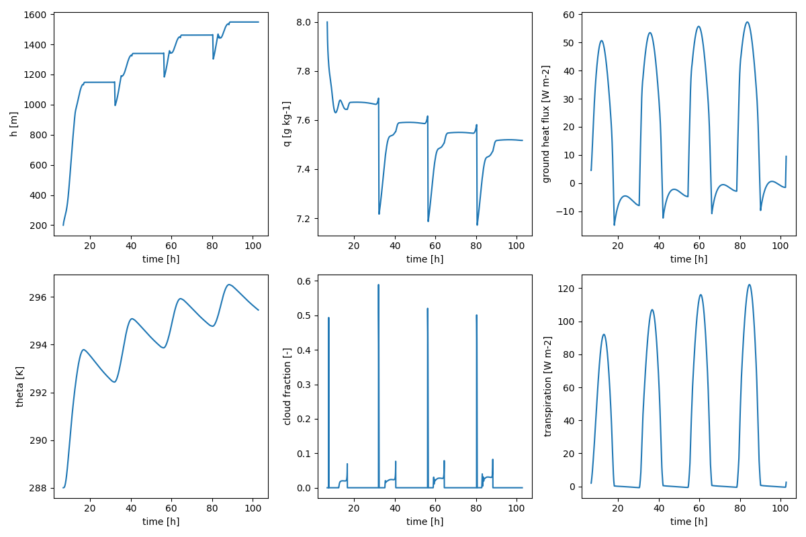

ABC Model
=========

A simple model coupling biosphere and atmosphere made fully differentiable using JAX built up on the `CLASS model <https://github.com/classmodel/modelpy>`_.

Installation
------------

These instructions work on Linux and MacOS and assume that python with pip is installed already. Otherwise, install python and pip with the tool of your choice, such as `miniforge <https://conda-forge.org/download/>`_ or `uv <https://docs.astral.sh/uv/>`_, before you proceed. See below for full instructions to install on Windows.

Install with

.. code-block:: bash

   pip install git@github.com:limamau/abc-model.git

or clone the repo and make an editable install inside your local repo using

.. code-block:: bash

   pip install -e .

If you want to use jax on GPUs, change the tag from ``[cpu]`` to ``[gpu]`` in an environment with GPUs installed.
This is not necessary to run the examples in this repository.

Quick example
-------------

To setup the coupler we will always use 3 components:

1. Radiation model (rad)
2. Land surface model (land)
3. Atmosphere model (atmos)

The atmosphere model uses 3 components:

3.1. Surface layer model

3.2. Mixed layer model

3.3. Cloud model

Each model is a class that is initialized with model-specific parameters. We provide a config example (which we take from the `CLASS model <https://github.com/classmodel/modelpy>`_).
This can be loaded through the ``abcconfigs`` module:

.. code-block:: python

   import abcconfigs.class_model as cm

Now we are ready to set up our models with ease...
We will do this using the ``abcmodel`` module, which is the *de facto* module in this repository.

.. code-block:: python

   import abcmodel

   # setup models
   rad_model = abcmodel.rad.StandardRadiationModel(**cm.standard_rad.model_kwargs)
   land_model = abcmodel.land.JarvisStewartModel(**cm.jarvis_stewart.model_kwargs)
   surface_layer_model = abcmodel.atmos.surface_layer.ObukhovSurfaceLayerModel()
   mixed_layer_model = abcmodel.atmos.mixed_layer.BulkMixedLayerModel(**cm.bulk_mixed_layer.model_kwargs)
   cloud_model = abcmodel.atmos.clouds.CumulusModel()

   # setup atmos model
   atmos_model = abcmodel.atmos.DayOnlyAtmosphereModel(
       surface_layer=surface_layer_model,
       mixed_layer=mixed_layer_model,
       clouds=cloud_model,
   )

   # setup coupler
   abcoupler = abcmodel.ABCoupler(
       rad=rad_model,
       land=land_model,
       atmos=atmos_model,
   )

   # setup initial conditions for each model
   rad_state = rad_model.init_state(**cm.standard_rad.state_kwargs)
   land_state = land_model.init_state(**cm.jarvis_stewart.state_kwargs)
   surface_layer_state = surface_layer_model.init_state(**cm.obukhov_surface_layer.state_kwargs)
   mixed_layer_state = mixed_layer_model.init_state(**cm.bulk_mixed_layer.state_kwargs)
   cloud_state = cloud_model.init_state()

   # setup atmos state
   atmos_state = atmos_model.init_state(
       surface=surface_layer_state,
       mixed=mixed_layer_state,
       clouds=cloud_state,
   )

   # finally we can use the coupler to bound everything in a initial state
   state = abcoupler.init_state(
       rad_state,
       land_state,
       atmos_state,
   )

All set - let's integrate our model by defining the timestepping and the run time.

.. code-block:: python

   # time step [s]
   inner_dt = 15.0 # this is the "running" time step
   outter_dt = 60.0 * 30 # this is the "diagnostic" time step
   # total run time [s]
   runtime = 12 * 3600.0
   # start time of the day [h]
   tstart = 6.5

   time, trajectory = abcmodel.integrate(
       state, abcoupler, inner_dt, outter_dt, runtime, tstart
   )

To plot the results, we will typically follow something like the code below.

.. code-block:: python

   import matplotlib.pyplot as plt

   # plot output
   plt.figure(figsize=(12, 8))

   plt.subplot(231)
   plt.plot(time, trajectory.atmos.mixed.h_abl)
   plt.xlabel("time [h]")
   plt.ylabel("h [m]")

   plt.subplot(234)
   plt.plot(time, trajectory.atmos.mixed.theta)
   plt.xlabel("time [h]")
   plt.ylabel("theta [K]")

   plt.subplot(232)
   plt.plot(time, trajectory.atmos.mixed.q * 1000.0)
   plt.xlabel("time [h]")
   plt.ylabel("q [g kg-1]")

   plt.subplot(235)
   plt.plot(time, trajectory.atmos.clouds.cc_frac)
   plt.xlabel("time [h]")
   plt.ylabel("cloud fraction [-]")

   plt.subplot(233)
   plt.plot(time, trajectory.land.gf)
   plt.xlabel("time [h]")
   plt.ylabel("ground heat flux [W m-2]")

   plt.subplot(236)
   plt.plot(time, trajectory.land.le_veg)
   plt.xlabel("time [h]")
   plt.ylabel("latent heat flux from vegetation [W m-2]")

   plt.tight_layout()
   plt.show()

Which should give us something like the figure below.

Documentation
-------------

Detailed documentation of the model is included in the repo. To view the documentation, navigate to ``docs/_build/html`` and run

.. code-block:: bash

   python -m http.server

This will launch a local http server displaying the interactive documentation and print the port to access it in your terminal.

Changing models, parameters and initial conditions
--------------------------------------------------

Now let's say you want to use a different model for the land surface.
Instead of the Jarvis Stewart model, you may choose Ags.
We also provide a configuration for that, which you can load using the ``abcconfigs`` module, as previously done.
You can take a look at the config `here <https://git.bgc-jena.mpg.de/abc3/abc-model/-/blob/main/src/abcconfigs/class_model/ags.py?ref_type=heads>`_.

Now, for example, you may change from C3 to C4 with something like the following.

.. code-block:: python

   # new parameters definition
   ags_model_kwargs = cm.ags.model_kwargs
   ags_model_kwargs['c3c4'] = 'c4'

   # define a new land model
   land_model = abcmodel.land.AgsModel(**ags_model_kwargs)

Then you can redefine the coupler, create a new state and integrate it to see different outcomes. You can do something similar to change initial conditions, or even recreate your own!

Windows installation
--------------------

On Windows we need some more utilities for jax to work properly, also installing python is not as straigforward. For jax to run, you first need the Microsoft Visual C++ redistributable found `here <https://learn.microsoft.com/en-us/cpp/windows/latest-supported-vc-redist?view=msvc-170#visual-studio-2015-2017-2019-and-2022>`_, which will require a system restart to function. Note that you might want to install uv before the restart, as the PATH update might require a restart as well (see below).

Now clone the repo and cd into it. The following section shows how to set up a python environment with `uv <https://docs.astral.sh/uv/>`_, if you have python with pip running you can skip it.

UV environment
~~~~~~~~~~~~~~

First install uv via the terminal with

.. code-block:: bash

   powershell -ExecutionPolicy ByPass -c "irm https://astral.sh/uv/install.ps1 | iex"

You can check that uv is available and running by typing ``uv`` in your terminal, if you receive an error, you will have to add uv to your path manually or `restart your computer <https://github.com/astral-sh/uv/issues/10014>`_. Here, or when executing uv scripts to activate environments windows `execution policiy <https://learn.microsoft.com/en-us/powershell/module/microsoft.powershell.core/about/about_execution_policies?view=powershell-7.4#powershell-execution-policies>`_ might stop you, if that is the case you need to change or bypass it.

After uv is installed and running, create a virtual environment in the abc-model directory by running

.. code-block:: bash

   uv venv --python 3.13.0

this will also show you the command needed to activate the venv, which should look similar to

.. code-block:: bash

   .venv\Scripts\activate

Lastly, while in the abc-model directory, install the abc-model with uv:

.. code-block:: bash

   uv pip install -e .

See also
--------

For a more advanced model, see `ClimaLand.jl <https://github.com/CliMA/ClimaLand.jl>`_.

.. toctree::
    :hidden:

    ABC Model <source/api/abcmodel>
    ABC Configs <source/api/abcconfigs>
